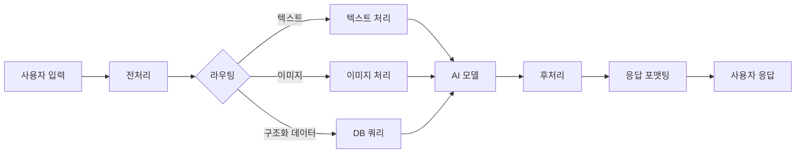

# 🏗️ Open WebUI + 자체 AI 시스템 통합 방법론

> **이 프로젝트의 접근 방식을 다른 AI 시스템과 데이터에 적용하는 일반적 방법론**

## 🎯 **방법론 개요**

이 문서는 **Open WebUI를 다양한 자체 AI 시스템과 통합**하는 범용적 방법론을 제시합니다. 우리가 구현한 RAG 시스템을 넘어서, 다양한 AI 모델, 데이터베이스, 서비스를 Open WebUI와 연결하는 **재사용 가능한 패턴**을 학습할 수 있습니다.

### **적용 가능한 시스템**
- 🤖 **다양한 LLM 모델** (Claude, Gemini, Llama, 자체 모델)
- 🔍 **검색 시스템** (Elasticsearch, Vector DB, SQL DB)
- 🧠 **AI 서비스** (이미지 생성, 음성 인식, 번역 등)
- 📊 **데이터 플랫폼** (Snowflake, BigQuery, MongoDB 등)
- 🌐 **외부 API** (Google Cloud, AWS, Azure AI 서비스)

---

## 📋 **1단계: 요구사항 분석**

### **1.1 시스템 현황 파악**

**기존 시스템 분석 체크리스트:**
```
□ 현재 사용 중인 AI 모델/서비스는?
□ 데이터는 어디에 저장되어 있나?
□ API 엔드포인트가 있나?
□ 인증 방식은?
□ 예상 사용량과 성능 요구사항은?
□ 보안/규정 준수 요구사항은?
```

**예시 시나리오:**
```yaml
시나리오 A: 기업 내부 Elasticsearch + GPT-4
- 데이터: Elasticsearch 클러스터의 기업 문서
- AI 모델: Azure OpenAI GPT-4
- 요구사항: 사내 보안 규정 준수

시나리오 B: 자체 훈련 모델 + PostgreSQL
- 데이터: PostgreSQL의 구조화된 데이터
- AI 모델: HuggingFace에서 파인튜닝한 모델
- 요구사항: 비용 최적화, 오프라인 작동

시나리오 C: 멀티모달 AI + 클라우드 스토리지
- 데이터: AWS S3의 이미지, 텍스트, 오디오
- AI 모델: GPT-4V + Whisper + DALL-E
- 요구사항: 다양한 입력 형식 지원
```

### **1.2 통합 복잡도 평가**

| 복잡도 레벨 | 특징 | 예시 |
|-------------|------|------|
| **🟢 단순** | 단일 API 엔드포인트<br/>표준 인터페이스 | OpenAI API, Anthropic API |
| **🟡 중간** | 여러 컴포넌트 조합<br/>데이터 전처리 필요 | Vector DB + LLM |
| **🔴 복잡** | 복잡한 워크플로우<br/>실시간 처리 | 멀티모달 + 실시간 학습 |

---

## 🚀 **2단계: 아키텍처 설계**

### **2.1 핵심 설계 패턴**

우리 프로젝트에서 검증된 **3가지 핵심 패턴**:

#### **패턴 1: API 프록시 패턴** ⭐
```
사용자 요청 → Open WebUI → API 프록시 서버 → 자체 시스템
```

**장점:** 
- ✅ 기존 시스템 최소 변경
- ✅ 표준 인터페이스 유지
- ✅ 빠른 구현 가능

**적용 사례:**
```python
# 예시: Elasticsearch + GPT-4 통합
@app.post("/v1/chat/completions")
async def chat_completions(request: ChatCompletionRequest):
    # 1. Elasticsearch에서 문서 검색
    search_results = elasticsearch_client.search(
        index="company-docs",
        body={"query": {"match": {"content": user_query}}}
    )
    
    # 2. GPT-4로 답변 생성
    context = format_search_results(search_results)
    gpt_response = openai_client.chat.completions.create(
        model="gpt-4",
        messages=[
            {"role": "system", "content": "You are a company assistant."},
            {"role": "user", "content": f"Context: {context}\n\nQuestion: {user_query}"}
        ]
    )
    
    return format_openai_response(gpt_response)
```

#### **패턴 2: 플러그인 패턴**
```
Open WebUI → Plugin Framework → 자체 플러그인
```

**적용 시나리오:**
- 복잡한 비즈니스 로직이 필요한 경우
- Open WebUI와 깊은 통합이 필요한 경우

#### **패턴 3: 마이크로서비스 패턴**
```
Open WebUI → API Gateway → 여러 마이크로서비스
```

**적용 시나리오:**
- 대규모 시스템
- 여러 AI 서비스 조합 필요

### **2.2 데이터 플로우 설계**

**일반적인 데이터 플로우:**


**실제 구현 예시:**
```python
class UniversalAIProcessor:
    def __init__(self):
        self.text_processor = TextProcessor()
        self.image_processor = ImageProcessor()
        self.db_connector = DatabaseConnector()
        self.ai_model = AIModel()
    
    async def process_request(self, request):
        # 1. 입력 분석 및 라우팅
        input_type = self.analyze_input(request)
        
        # 2. 적절한 프로세서 선택
        if input_type == "text":
            data = self.text_processor.process(request)
        elif input_type == "image":
            data = self.image_processor.process(request)
        elif input_type == "structured":
            data = self.db_connector.query(request)
        
        # 3. AI 모델로 처리
        result = await self.ai_model.generate(data)
        
        # 4. 응답 포맷팅
        return self.format_response(result)
```

---

## 🔧 **3단계: 핵심 컴포넌트 구현**

### **3.1 범용 API 프록시 서버**

```python
# universal_proxy.py
from typing import Protocol, Any, Dict, List
from abc import ABC, abstractmethod

class AIBackend(Protocol):
    """AI 백엔드 인터페이스"""
    async def process_query(self, query: str, context: Dict[str, Any]) -> str:
        ...
    
    def get_model_info(self) -> Dict[str, Any]:
        ...

class DataSource(Protocol):
    """데이터 소스 인터페이스"""
    async def search(self, query: str) -> List[Dict[str, Any]]:
        ...

class UniversalProxyServer:
    """범용 프록시 서버"""
    
    def __init__(self, ai_backend: AIBackend, data_source: DataSource):
        self.ai_backend = ai_backend
        self.data_source = data_source
        self.app = FastAPI()
        self._setup_routes()
    
    def _setup_routes(self):
        @self.app.get("/v1/models")
        async def get_models():
            return {
                "data": [self.ai_backend.get_model_info()]
            }
        
        @self.app.post("/v1/chat/completions")
        async def chat_completions(request: ChatCompletionRequest):
            # 1. 데이터 검색
            search_results = await self.data_source.search(
                request.messages[-1].content
            )
            
            # 2. AI 처리
            response = await self.ai_backend.process_query(
                query=request.messages[-1].content,
                context={"search_results": search_results}
            )
            
            # 3. 표준 응답 형식으로 변환
            return self._format_response(response, request.model)

# 구체적인 구현 예시
class ElasticsearchDataSource:
    def __init__(self, es_client, index_name):
        self.es_client = es_client
        self.index_name = index_name
    
    async def search(self, query: str) -> List[Dict[str, Any]]:
        response = self.es_client.search(
            index=self.index_name,
            body={
                "query": {"multi_match": {"query": query}},
                "size": 10
            }
        )
        return [hit["_source"] for hit in response["hits"]["hits"]]

class GPT4Backend:
    def __init__(self, openai_client):
        self.client = openai_client
    
    async def process_query(self, query: str, context: Dict[str, Any]) -> str:
        search_results = context.get("search_results", [])
        context_text = "\n".join([r.get("content", "") for r in search_results])
        
        response = self.client.chat.completions.create(
            model="gpt-4",
            messages=[
                {"role": "system", "content": "You are a helpful assistant."},
                {"role": "user", "content": f"Context: {context_text}\n\nQuestion: {query}"}
            ]
        )
        
        return response.choices[0].message.content

# 사용법
if __name__ == "__main__":
    # 백엔드와 데이터 소스 초기화
    ai_backend = GPT4Backend(openai_client)
    data_source = ElasticsearchDataSource(es_client, "company-docs")
    
    # 프록시 서버 시작
    proxy = UniversalProxyServer(ai_backend, data_source)
    uvicorn.run(proxy.app, host="0.0.0.0", port=8000)
```

### **3.2 구성 기반 시스템**

**설정 파일로 다양한 시스템 지원:**

```yaml
# config.yml
ai_backend:
  type: "openai"  # openai, anthropic, huggingface, custom
  config:
    model: "gpt-4"
    api_key: "${OPENAI_API_KEY}"
    temperature: 0.7

data_source:
  type: "elasticsearch"  # elasticsearch, faiss, postgresql, mongodb
  config:
    host: "localhost:9200"
    index: "company-docs"
    
processing:
  max_context_length: 4000
  chunk_overlap: 200
  search_top_k: 10

response_format:
  structured: true
  include_sources: true
  max_length: 2000
```

```python
# config_driven_system.py
import yaml
from typing import Dict, Any

class ConfigurableAISystem:
    def __init__(self, config_path: str):
        with open(config_path) as f:
            self.config = yaml.safe_load(f)
        
        self.ai_backend = self._create_ai_backend()
        self.data_source = self._create_data_source()
    
    def _create_ai_backend(self) -> AIBackend:
        backend_type = self.config["ai_backend"]["type"]
        config = self.config["ai_backend"]["config"]
        
        if backend_type == "openai":
            return OpenAIBackend(**config)
        elif backend_type == "anthropic":
            return AnthropicBackend(**config)
        elif backend_type == "huggingface":
            return HuggingFaceBackend(**config)
        else:
            raise ValueError(f"Unsupported backend: {backend_type}")
    
    def _create_data_source(self) -> DataSource:
        source_type = self.config["data_source"]["type"]
        config = self.config["data_source"]["config"]
        
        if source_type == "elasticsearch":
            return ElasticsearchDataSource(**config)
        elif source_type == "faiss":
            return FAISSDataSource(**config)
        elif source_type == "postgresql":
            return PostgreSQLDataSource(**config)
        else:
            raise ValueError(f"Unsupported data source: {source_type}")

# 사용법
system = ConfigurableAISystem("config.yml")
proxy = UniversalProxyServer(system.ai_backend, system.data_source)
```

---

## 📊 **4단계: 다양한 시스템 적용 예시**

### **4.1 Elasticsearch + Claude 통합**

```python
class ElasticsearchClaudeIntegration:
    def __init__(self, es_client, anthropic_client):
        self.es_client = es_client
        self.claude = anthropic_client
    
    async def process_query(self, query: str) -> str:
        # 1. Elasticsearch에서 검색
        search_response = self.es_client.search(
            index="knowledge-base",
            body={
                "query": {
                    "bool": {
                        "should": [
                            {"match": {"title": {"query": query, "boost": 2}}},
                            {"match": {"content": query}},
                            {"match": {"tags": query}}
                        ]
                    }
                },
                "size": 5,
                "_source": ["title", "content", "url", "timestamp"]
            }
        )
        
        # 2. 검색 결과를 컨텍스트로 구성
        documents = []
        for hit in search_response["hits"]["hits"]:
            source = hit["_source"]
            documents.append({
                "title": source["title"],
                "content": source["content"][:500],  # 길이 제한
                "relevance_score": hit["_score"]
            })
        
        # 3. Claude로 답변 생성
        context = "\n".join([f"제목: {doc['title']}\n내용: {doc['content']}" 
                            for doc in documents])
        
        response = await self.claude.messages.create(
            model="claude-3-sonnet-20240229",
            max_tokens=1000,
            messages=[{
                "role": "user",
                "content": f"""
                다음 검색된 문서들을 바탕으로 질문에 답변해주세요.
                
                검색 결과:
                {context}
                
                질문: {query}
                
                답변 시 다음 형식을 따라주세요:
                ## 요약
                ## 상세 설명  
                ## 관련 문서
                """
            }]
        )
        
        return response.content[0].text
```

### **4.2 PostgreSQL + 로컬 모델 통합**

```python
import psycopg2
from transformers import pipeline, AutoTokenizer, AutoModelForCausalLM

class PostgreSQLLocalModelIntegration:
    def __init__(self, db_config, model_name="microsoft/DialoGPT-medium"):
        # PostgreSQL 연결
        self.conn = psycopg2.connect(**db_config)
        
        # 로컬 모델 로드
        self.tokenizer = AutoTokenizer.from_pretrained(model_name)
        self.model = AutoModelForCausalLM.from_pretrained(model_name)
        self.generator = pipeline(
            "text-generation", 
            model=self.model, 
            tokenizer=self.tokenizer
        )
    
    def search_database(self, query: str) -> List[Dict[str, Any]]:
        """PostgreSQL에서 전문 검색"""
        cursor = self.conn.cursor()
        
        # 전문 검색 쿼리 (PostgreSQL의 full-text search 사용)
        search_query = """
        SELECT title, content, category, 
               ts_rank(search_vector, plainto_tsquery(%s)) AS rank
        FROM documents 
        WHERE search_vector @@ plainto_tsquery(%s)
        ORDER BY rank DESC
        LIMIT 10;
        """
        
        cursor.execute(search_query, (query, query))
        results = cursor.fetchall()
        
        return [
            {
                "title": row[0],
                "content": row[1], 
                "category": row[2],
                "relevance": row[3]
            }
            for row in results
        ]
    
    def generate_response(self, query: str, context: List[Dict]) -> str:
        """로컬 모델로 응답 생성"""
        # 컨텍스트 구성
        context_text = "\n".join([
            f"[{doc['category']}] {doc['title']}: {doc['content'][:200]}..."
            for doc in context[:3]  # 상위 3개 문서만 사용
        ])
        
        # 프롬프트 생성
        prompt = f"""
        참고 문서:
        {context_text}
        
        질문: {query}
        답변:"""
        
        # 로컬 모델로 생성
        response = self.generator(
            prompt,
            max_length=len(prompt.split()) + 100,
            num_return_sequences=1,
            temperature=0.7,
            pad_token_id=self.tokenizer.eos_token_id
        )
        
        generated_text = response[0]['generated_text']
        answer = generated_text[len(prompt):].strip()
        
        return answer
    
    async def process_query(self, query: str) -> str:
        # 1. DB 검색
        search_results = self.search_database(query)
        
        # 2. 로컬 모델로 응답 생성
        if search_results:
            response = self.generate_response(query, search_results)
        else:
            response = "관련된 정보를 찾을 수 없습니다."
        
        return response
```

### **4.3 멀티모달 시스템 (이미지 + 텍스트)**

```python
from PIL import Image
import base64
from io import BytesIO

class MultimodalAIIntegration:
    def __init__(self, openai_client, vector_store):
        self.openai = openai_client
        self.vector_store = vector_store
    
    def process_image(self, image_data: str) -> str:
        """이미지 분석 (GPT-4V 사용)"""
        response = self.openai.chat.completions.create(
            model="gpt-4-vision-preview",
            messages=[
                {
                    "role": "user",
                    "content": [
                        {
                            "type": "text",
                            "text": "이 이미지에서 중요한 정보를 추출해주세요."
                        },
                        {
                            "type": "image_url",
                            "image_url": {
                                "url": f"data:image/jpeg;base64,{image_data}"
                            }
                        }
                    ]
                }
            ],
            max_tokens=300
        )
        
        return response.choices[0].message.content
    
    async def process_multimodal_query(self, query: str, images: List[str] = None) -> str:
        """멀티모달 쿼리 처리"""
        context_parts = []
        
        # 1. 이미지가 있으면 분석
        if images:
            for i, image_data in enumerate(images):
                image_analysis = self.process_image(image_data)
                context_parts.append(f"이미지 {i+1} 분석: {image_analysis}")
        
        # 2. 텍스트 검색
        text_results = self.vector_store.similarity_search(query, k=5)
        text_context = "\n".join([doc.page_content for doc in text_results])
        
        # 3. 통합 응답 생성
        combined_context = "\n".join(context_parts) + "\n" + text_context
        
        response = self.openai.chat.completions.create(
            model="gpt-4",
            messages=[
                {
                    "role": "system",
                    "content": "당신은 텍스트와 이미지 정보를 종합하여 답변하는 AI입니다."
                },
                {
                    "role": "user", 
                    "content": f"""
                    다음 정보들을 바탕으로 질문에 답변해주세요:
                    
                    {combined_context}
                    
                    질문: {query}
                    """
                }
            ]
        )
        
        return response.choices[0].message.content
```

---

## 🔄 **5단계: 배치 및 확장**

### **5.1 Docker 컨테이너화 패턴**

```dockerfile
# Dockerfile
FROM python:3.11-slim

WORKDIR /app

# 시스템 의존성 설치
RUN apt-get update && apt-get install -y \
    build-essential \
    curl \
    && rm -rf /var/lib/apt/lists/*

# Python 의존성 설치
COPY requirements.txt .
RUN pip install --no-cache-dir -r requirements.txt

# 애플리케이션 코드 복사
COPY . .

# 환경 변수 설정
ENV PYTHONPATH=/app
ENV UVICORN_HOST=0.0.0.0
ENV UVICORN_PORT=8000

# 헬스체크 설정
HEALTHCHECK --interval=30s --timeout=30s --start-period=5s --retries=3 \
    CMD curl -f http://localhost:8000/health || exit 1

# 포트 노출
EXPOSE 8000

# 실행 명령
CMD ["python", "main.py"]
```

### **5.2 Kubernetes 배포 패턴**

```yaml
# k8s-configmap.yml
apiVersion: v1
kind: ConfigMap
metadata:
  name: ai-system-config
data:
  config.yml: |
    ai_backend:
      type: "openai"
      config:
        model: "gpt-4"
        temperature: 0.7
    data_source:
      type: "elasticsearch"
      config:
        host: "elasticsearch-service:9200"
        index: "knowledge-base"

---
# k8s-deployment.yml
apiVersion: apps/v1
kind: Deployment
metadata:
  name: custom-ai-system
spec:
  replicas: 3
  selector:
    matchLabels:
      app: custom-ai-system
  template:
    metadata:
      labels:
        app: custom-ai-system
    spec:
      containers:
      - name: ai-system
        image: your-registry/custom-ai-system:latest
        ports:
        - containerPort: 8000
        env:
        - name: OPENAI_API_KEY
          valueFrom:
            secretKeyRef:
              name: api-secrets
              key: openai-key
        volumeMounts:
        - name: config-volume
          mountPath: /app/config
        resources:
          requests:
            memory: "1Gi"
            cpu: "500m"
          limits:
            memory: "2Gi"
            cpu: "1000m"
      volumes:
      - name: config-volume
        configMap:
          name: ai-system-config
```

### **5.3 모니터링 및 로깅**

```python
# monitoring.py
import time
import logging
from functools import wraps
from prometheus_client import Counter, Histogram, Gauge

# 메트릭 정의
REQUEST_COUNT = Counter('ai_requests_total', 'Total requests', ['method', 'endpoint'])
REQUEST_DURATION = Histogram('ai_request_duration_seconds', 'Request duration')
ACTIVE_CONNECTIONS = Gauge('ai_active_connections', 'Active connections')
ERROR_COUNT = Counter('ai_errors_total', 'Total errors', ['error_type'])

# 로깅 설정
logging.basicConfig(
    level=logging.INFO,
    format='%(asctime)s - %(name)s - %(levelname)s - %(message)s'
)
logger = logging.getLogger(__name__)

def monitor_request(func):
    """요청 모니터링 데코레이터"""
    @wraps(func)
    async def wrapper(*args, **kwargs):
        start_time = time.time()
        REQUEST_COUNT.labels(method='POST', endpoint='/v1/chat/completions').inc()
        ACTIVE_CONNECTIONS.inc()
        
        try:
            result = await func(*args, **kwargs)
            logger.info(f"Request processed successfully in {time.time() - start_time:.2f}s")
            return result
            
        except Exception as e:
            ERROR_COUNT.labels(error_type=type(e).__name__).inc()
            logger.error(f"Request failed: {str(e)}")
            raise
            
        finally:
            REQUEST_DURATION.observe(time.time() - start_time)
            ACTIVE_CONNECTIONS.dec()
    
    return wrapper
```

---

## 📈 **6단계: 성능 최적화**

### **6.1 캐싱 전략**

```python
# caching_strategies.py
import redis
import pickle
from functools import wraps
from typing import Any, Callable

class CachingStrategy:
    def __init__(self, redis_client: redis.Redis):
        self.redis = redis_client
        self.default_ttl = 3600  # 1시간
    
    def cache_search_results(self, ttl: int = None):
        """검색 결과 캐싱 데코레이터"""
        def decorator(func: Callable) -> Callable:
            @wraps(func)
            async def wrapper(*args, **kwargs):
                # 캐시 키 생성
                cache_key = f"search:{hash(str(args) + str(kwargs))}"
                
                # 캐시에서 확인
                cached_result = self.redis.get(cache_key)
                if cached_result:
                    return pickle.loads(cached_result)
                
                # 실제 검색 수행
                result = await func(*args, **kwargs)
                
                # 캐시에 저장
                self.redis.setex(
                    cache_key, 
                    ttl or self.default_ttl,
                    pickle.dumps(result)
                )
                
                return result
            return wrapper
        return decorator
    
    def cache_ai_response(self, ttl: int = None):
        """AI 응답 캐싱 데코레이터"""
        def decorator(func: Callable) -> Callable:
            @wraps(func)
            async def wrapper(*args, **kwargs):
                # 질문 해시를 캐시 키로 사용
                query = kwargs.get('query') or args[0]
                cache_key = f"ai_response:{hash(query)}"
                
                cached_response = self.redis.get(cache_key)
                if cached_response:
                    return cached_response.decode('utf-8')
                
                response = await func(*args, **kwargs)
                
                self.redis.setex(
                    cache_key,
                    ttl or self.default_ttl, 
                    response
                )
                
                return response
            return wrapper
        return decorator

# 사용 예시
caching = CachingStrategy(redis.Redis(host='localhost', port=6379))

class OptimizedAISystem:
    @caching.cache_search_results(ttl=1800)  # 30분 캐싱
    async def search_documents(self, query: str):
        # 실제 검색 로직
        return expensive_search_operation(query)
    
    @caching.cache_ai_response(ttl=3600)  # 1시간 캐싱  
    async def generate_response(self, query: str):
        # 실제 AI 생성 로직
        return expensive_ai_generation(query)
```

### **6.2 비동기 처리 최적화**

```python
# async_optimization.py
import asyncio
from concurrent.futures import ThreadPoolExecutor
from typing import List, Any

class AsyncAIProcessor:
    def __init__(self, max_workers: int = 4):
        self.executor = ThreadPoolExecutor(max_workers=max_workers)
    
    async def parallel_search(self, query: str) -> Dict[str, Any]:
        """여러 소스에서 병렬 검색"""
        
        # 병렬 실행할 작업들
        tasks = [
            self.search_vector_store(query),
            self.search_database(query), 
            self.search_web(query)
        ]
        
        # 모든 작업을 병렬로 실행
        vector_results, db_results, web_results = await asyncio.gather(
            *tasks, return_exceptions=True
        )
        
        # 예외 처리
        results = {}
        if not isinstance(vector_results, Exception):
            results['vector'] = vector_results
        if not isinstance(db_results, Exception):
            results['database'] = db_results
        if not isinstance(web_results, Exception):
            results['web'] = web_results
        
        return results
    
    async def search_vector_store(self, query: str):
        """벡터 스토어 검색 (CPU 집약적 작업)"""
        loop = asyncio.get_event_loop()
        return await loop.run_in_executor(
            self.executor, 
            self._sync_vector_search, 
            query
        )
    
    def _sync_vector_search(self, query: str):
        # 동기적 벡터 검색 작업
        return vector_store.similarity_search(query, k=5)
    
    async def batch_processing(self, queries: List[str]) -> List[str]:
        """배치 처리로 여러 질문 동시 처리"""
        
        # 세마포어로 동시 처리 수 제한
        semaphore = asyncio.Semaphore(10)
        
        async def process_single_query(query: str) -> str:
            async with semaphore:
                return await self.generate_response(query)
        
        # 모든 질문을 병렬 처리
        tasks = [process_single_query(q) for q in queries]
        results = await asyncio.gather(*tasks, return_exceptions=True)
        
        return [r if not isinstance(r, Exception) else "Error" for r in results]
```

---

## 🎯 **7단계: 품질 보증 및 테스트**

### **7.1 자동화된 테스트 프레임워크**

```python
# testing_framework.py
import pytest
import asyncio
from typing import List, Dict, Any

class AISystemTester:
    def __init__(self, ai_system):
        self.ai_system = ai_system
        self.test_cases = self.load_test_cases()
    
    def load_test_cases(self) -> List[Dict[str, Any]]:
        """테스트 케이스 로드"""
        return [
            {
                "query": "한국의 AI 정책은?",
                "expected_keywords": ["정책", "AI", "한국"],
                "min_length": 100,
                "max_response_time": 10.0
            },
            {
                "query": "삼성전자 실적 분석",
                "expected_keywords": ["삼성", "실적", "분석"], 
                "min_length": 200,
                "max_response_time": 15.0
            }
        ]
    
    @pytest.mark.asyncio
    async def test_response_quality(self):
        """응답 품질 테스트"""
        for test_case in self.test_cases:
            start_time = asyncio.get_event_loop().time()
            
            response = await self.ai_system.process_query(test_case["query"])
            
            response_time = asyncio.get_event_loop().time() - start_time
            
            # 응답 시간 검증
            assert response_time < test_case["max_response_time"], \
                f"Response too slow: {response_time}s"
            
            # 응답 길이 검증
            assert len(response) >= test_case["min_length"], \
                f"Response too short: {len(response)} chars"
            
            # 키워드 포함 검증
            for keyword in test_case["expected_keywords"]:
                assert keyword in response.lower(), \
                    f"Missing keyword '{keyword}' in response"
    
    async def test_error_handling(self):
        """에러 처리 테스트"""
        error_cases = [
            "",  # 빈 문자열
            "x" * 10000,  # 너무 긴 입력
            "🚀" * 100,  # 특수문자만
        ]
        
        for error_input in error_cases:
            try:
                response = await self.ai_system.process_query(error_input)
                assert response is not None
                assert "오류" in response or "error" in response.lower()
            except Exception as e:
                # 예외가 발생해도 서버가 죽지 않아야 함
                assert "Internal Server Error" not in str(e)
    
    async def test_concurrent_requests(self):
        """동시 요청 처리 테스트"""
        queries = ["테스트 질문 " + str(i) for i in range(20)]
        
        # 20개 요청을 동시에 보냄
        tasks = [self.ai_system.process_query(q) for q in queries]
        responses = await asyncio.gather(*tasks, return_exceptions=True)
        
        # 모든 요청이 성공적으로 처리되었는지 확인
        for i, response in enumerate(responses):
            assert not isinstance(response, Exception), \
                f"Request {i} failed: {response}"
            assert len(response) > 0, f"Empty response for request {i}"

# 실행
if __name__ == "__main__":
    pytest.main([__file__, "-v"])
```

### **7.2 성능 벤치마크**

```python
# benchmark.py
import time
import asyncio
import statistics
from typing import List

class PerformanceBenchmark:
    def __init__(self, ai_system):
        self.ai_system = ai_system
        
    async def benchmark_latency(self, queries: List[str], iterations: int = 10):
        """지연 시간 벤치마크"""
        latencies = []
        
        for query in queries:
            query_latencies = []
            
            for _ in range(iterations):
                start_time = time.time()
                await self.ai_system.process_query(query)
                latency = time.time() - start_time
                query_latencies.append(latency)
            
            avg_latency = statistics.mean(query_latencies)
            p95_latency = statistics.quantiles(query_latencies, n=20)[18]  # 95th percentile
            
            latencies.append({
                "query": query[:50] + "..." if len(query) > 50 else query,
                "avg_latency": avg_latency,
                "p95_latency": p95_latency,
                "min_latency": min(query_latencies),
                "max_latency": max(query_latencies)
            })
        
        return latencies
    
    async def benchmark_throughput(self, query: str, duration: int = 60):
        """처리량 벤치마크"""
        start_time = time.time()
        completed_requests = 0
        errors = 0
        
        async def make_request():
            nonlocal completed_requests, errors
            try:
                await self.ai_system.process_query(query)
                completed_requests += 1
            except Exception:
                errors += 1
        
        # 1분간 최대한 많은 요청 보내기
        tasks = []
        while time.time() - start_time < duration:
            if len(tasks) < 100:  # 최대 100개 동시 요청
                task = asyncio.create_task(make_request())
                tasks.append(task)
            
            # 완료된 태스크 정리
            tasks = [t for t in tasks if not t.done()]
            await asyncio.sleep(0.01)
        
        # 남은 태스크 완료 대기
        if tasks:
            await asyncio.gather(*tasks, return_exceptions=True)
        
        total_time = time.time() - start_time
        throughput = completed_requests / total_time
        error_rate = errors / (completed_requests + errors) if (completed_requests + errors) > 0 else 0
        
        return {
            "throughput_rps": throughput,
            "total_requests": completed_requests,
            "total_errors": errors,
            "error_rate": error_rate,
            "duration": total_time
        }

# 사용 예시
async def run_benchmarks():
    benchmark = PerformanceBenchmark(your_ai_system)
    
    # 지연 시간 테스트
    test_queries = ["한국 AI 정책", "삼성전자 분석", "최신 기술 동향"]
    latency_results = await benchmark.benchmark_latency(test_queries)
    
    print("=== 지연 시간 벤치마크 ===")
    for result in latency_results:
        print(f"Query: {result['query']}")
        print(f"  평균: {result['avg_latency']:.2f}s")
        print(f"  95th %ile: {result['p95_latency']:.2f}s")
        print()
    
    # 처리량 테스트
    throughput_result = await benchmark.benchmark_throughput("테스트 질문")
    
    print("=== 처리량 벤치마크 ===")
    print(f"처리량: {throughput_result['throughput_rps']:.2f} requests/sec")
    print(f"총 요청: {throughput_result['total_requests']}")
    print(f"오류율: {throughput_result['error_rate']:.2%}")

# 실행
if __name__ == "__main__":
    asyncio.run(run_benchmarks())
```

---

## 🎉 **결론 및 다음 단계**

### **🏆 이 방법론을 통해 달성할 수 있는 것**

1. **🚀 빠른 프로토타이핑**: 기존 시스템을 Open WebUI와 몇 시간 내에 연동
2. **🔧 유연한 확장**: 다양한 AI 모델과 데이터 소스를 플러그인 방식으로 추가
3. **📈 프로덕션 준비**: 모니터링, 캐싱, 에러 처리가 포함된 안정적인 시스템
4. **🌐 표준 호환**: OpenAI API 호환으로 다른 도구들과도 연동 가능

### **🛤️ 구현 로드맵**

**Phase 1: 기본 통합 (1-2주)**
- [ ] 요구사항 분석 및 아키텍처 설계
- [ ] 기본 API 프록시 서버 구현
- [ ] Open WebUI 연동 테스트

**Phase 2: 기능 확장 (2-3주)**
- [ ] 고급 검색 및 AI 처리 로직 구현
- [ ] 캐싱 및 성능 최적화
- [ ] 에러 처리 및 로깅 시스템 구축

**Phase 3: 프로덕션 배포 (1-2주)**
- [ ] Docker 컨테이너화 및 K8s 배포
- [ ] 모니터링 및 알림 시스템 구축
- [ ] 부하 테스트 및 성능 튜닝

### **💡 성공을 위한 핵심 팁**

1. **단계적 접근**: 한 번에 모든 것을 구현하지 말고 단계별로 진행
2. **표준 준수**: OpenAI API 스펙을 정확히 구현하여 호환성 보장
3. **테스트 우선**: 각 단계에서 충분한 테스트를 통해 안정성 확보
4. **모니터링 필수**: 운영 환경에서의 성능과 오류를 실시간으로 추적
5. **문서화**: 팀원들이 쉽게 이해하고 유지보수할 수 있도록 문서 작성

### **🌟 확장 아이디어**

- **멀티 테넌트**: 여러 조직이나 부서별로 격리된 AI 시스템
- **A/B 테스팅**: 다양한 AI 모델이나 검색 알고리즘 비교
- **실시간 학습**: 사용자 피드백을 통한 시스템 개선
- **멀티모달 지원**: 텍스트, 이미지, 음성을 통합한 AI 어시스턴트

---

**🎯 이 방법론을 따르면, 어떤 AI 시스템이든 Open WebUI와 성공적으로 통합할 수 있습니다!**

**시작이 반입니다. 지금 바로 첫 단계를 실행해보세요! 🚀**
