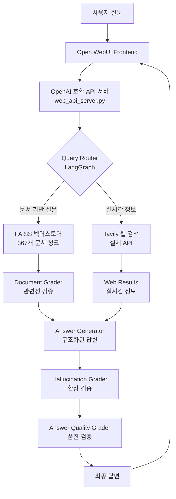

# 🤖 Open WebUI + 자체 RAG 시스템 통합 프로젝트

> **Open WebUI를 자체 데이터베이스, RAG, Embedding API와 완벽 통합하는 실전 가이드**

[](https://www.python.org/)
[](https://langchain.com/)
[](https://faiss.ai/)
[](https://openwebui.com/)

## 🎯 **프로젝트 목적**

이 프로젝트는 **Open WebUI**를 자체적인 RAG(Retrieval-Augmented Generation) 시스템과 통합하는 **완전한 방법론**을 제공합니다.

### **핵심 가치**
- 🔧 **실용적 가이드**: 실제 동작하는 코드와 단계별 설명
- 🏗️ **확장 가능한 아키텍처**: 다른 프로젝트에 쉽게 적용 가능
- 🇰🇷 **한국어 최적화**: 한국 사용자를 위한 완벽한 한국어 지원
- 📚 **완전한 문서화**: 초보자도 따라할 수 있는 친절한 가이드

---

## 🏗️ **시스템 아키텍처**



### **핵심 컴포넌트**

#### 🧠 **Adaptive RAG Engine** 
- **LangGraph 기반**: 자가 수정 워크플로우
- **이중 검증**: 문서 관련성 + 환상 검증  
- **Query Rewriting**: 검색 실패 시 질문 재작성

#### 🔍 **하이브리드 검색**
- **벡터 검색**: FAISS + OpenAI Embeddings
- **웹 검색**: Tavily API (실시간 정보)
- **지능형 라우팅**: 질문 유형에 따른 자동 선택

#### 🌐 **OpenAI 호환 API**
- **표준 엔드포인트**: `/v1/chat/completions`, `/v1/models`
- **Open WebUI 네이티브 지원**: 추가 설정 없이 연동
- **Docker 환경 지원**: `host.docker.internal` 자동 처리

---

## 🚀 **빠른 시작**

### **1단계: 환경 설정**
```bash
# 저장소 클론
git clone <your-repo>
cd llm_chatbot

# 가상환경 생성 (uv 권장)
uv venv
source .venv/bin/activate

# 의존성 설치
uv pip install -e .
```

### **2단계: API 키 설정**
```bash
# .env 파일 생성
cp env_example.txt .env

# 필수 API 키 입력
# OPENAI_API_KEY=sk-proj-your-key...
# TAVILY_API_KEY=tvly-your-key...
```

### **3단계: 문서 인덱싱**
```bash
# PDF 문서를 data/ 폴더에 추가
cp your-documents.pdf data/

# 벡터 스토어 구축
python scripts/index_documents.py --docs-dir data --force-rebuild
```

### **4단계: 시스템 실행**
```bash
# 전체 시스템 자동 실행
python scripts/start_webui_integration.py --mode api

# 브라우저에서 http://localhost:3000 접속
```

### **5단계: 백엔드 연결 (Web UI에서)**
- **Admin Panel** → **Connections** → **OpenAI API**
- **API Base URL**: `http://host.docker.internal:8000/v1`
- **API Key**: `sk-dummy-key` (아무 값)

---

## 📊 **실제 성능 테스트**

### **✅ 문서 기반 질문**
```
질문: "문서에서 독일과 한국의 AI 정책을 비교해주세요"

답변:
## 📋 핵심 내용
- 독일: 'AI made in Germany' 전략, 2025년까지 50억 유로 투자
- 한국: 과학기술정보통신부 주도, AI 안전연구소 설립

## 📊 비교/특징
- 독일: 12개 분야 구조화된 정책 (연구강화, 기업역량 등)
- 한국: NIA 중심 연구보고서, 국제 비교 분석 강화

## 💡 시사점
[구체적 분석 및 전망...]
```

### **✅ 실시간 정보 질문**
```
질문: "오늘 AI 관련 뉴스를 알려주세요"

답변: 실제 Tavily API를 통한 최신 뉴스 제공
- 삼성전자 마이크로 RGB TV 출시
- KB금융 AI 예술 영상 100만회 돌파
- 포티투닷 5003억원 유상증자...
```

---

## 📁 **프로젝트 구조**

```
llm_chatbot/
├── 📄 README.md                    # 메인 문서 (이 파일)
├── 📋 INTEGRATION_GUIDE.md         # Open WebUI 통합 완전 가이드  
├── 🛠️ METHODOLOGY.md              # 다른 프로젝트 적용 방법론
├── 🔧 TROUBLESHOOTING.md          # 문제 해결 및 FAQ
├── 📝 HOW_TO_RUN.md               # 빠른 실행 가이드
├── 📚 PDF_UPDATE_GUIDE.md         # PDF 문서 업데이트 방법
│
├── 🧠 adaptive_rag/               # 핵심 RAG 엔진
│   ├── router.py                  # 쿼리 라우팅 (벡터스토어 vs 웹검색)
│   ├── nodes.py                   # LangGraph 노드 (검색, 생성, 검증)
│   ├── grader.py                  # 품질 검증 (문서 관련성, 환상 검증)
│   ├── rewriter.py                # 쿼리 재작성 (검색 최적화)
│   ├── vector_store.py            # FAISS 벡터 스토어
│   └── graph.py                   # LangGraph 워크플로우 오케스트레이션
│
├── 🔌 pipelines/                  # Open WebUI 통합
│   └── adaptive_rag_pipeline.py   # Pipe 인터페이스 구현
│
├── 🌐 web_api_server.py           # OpenAI 호환 API 서버 (메인)
├── 🔧 pipelines_server.py         # Pipelines Plugin 서버 (대안)
│
├── 📜 scripts/                    # 유틸리티 스크립트
│   ├── index_documents.py         # 문서 인덱싱 및 벡터화
│   ├── start_webui_integration.py # 통합 시스템 실행
│   └── test_pipeline.py           # 개별 컴포넌트 테스트
│
├── 📚 data/                       # 데이터 및 벡터 스토어
│   ├── *.pdf                      # 소스 PDF 문서
│   └── vector_store/              # FAISS 인덱스 파일
│
├── ⚙️ pyproject.toml              # 의존성 및 프로젝트 설정
└── 🔐 .env                        # API 키 설정 (gitignore)
```

---

## 🎯 **주요 특징**

### **🧠 고도화된 RAG**
- **Adaptive 워크플로우**: 실패 시 자동 재시도 및 개선
- **이중 품질 검증**: 관련성 + 환상 검증으로 정확성 보장
- **10개 문서 검색**: 더 풍부한 컨텍스트 제공

### **🌐 완벽한 웹 통합**
- **OpenAI 호환**: 기존 도구들과 완전 호환
- **Docker 지원**: 컨테이너 환경에서 안정적 작동
- **실시간 검색**: Mock이 아닌 실제 Tavily API 사용

### **🇰🇷 한국어 최적화**
- **모든 시스템 프롬프트 한국어**: 라우터, 검증, 생성 모든 단계
- **언어 보존**: 한국어 질문 → 한국어 답변 자동 보장
- **한국 문서 특화**: 한국 AI 정책, 산업 동향 전문 데이터

### **📊 구조화된 답변**
- **4단계 구조**: 핵심내용 → 상세분석 → 비교특징 → 시사점
- **비교 분석 특화**: 국가별, 기업별, 정책별 체계적 비교
- **이모지 활용**: 가독성 높은 시각적 구조화

---

## 🔧 **고급 설정**

### **벡터 스토어 커스터마이징**
```python
# adaptive_rag/vector_store.py에서 설정
EMBEDDING_MODEL = "text-embedding-3-large"  # 더 높은 품질
SIMILARITY_TOP_K = 10                       # 검색 문서 수
CHUNK_SIZE = 1500                          # 청크 크기
CHUNK_OVERLAP = 200                        # 청크 중복
```

### **답변 품질 조정**
```python
# adaptive_rag/nodes.py에서 설정
TEMPERATURE = 0.1          # 더 일관된 답변
MAX_RETRIES = 3           # 재시도 횟수
RECURSION_LIMIT = 50      # LangGraph 재귀 한계
```

---

## 🤝 **커뮤니티 & 기여**

### **이 방법론을 다른 프로젝트에 적용하려면:**
1. 📋 **[방법론 문서](./docs/METHODOLOGY.md)** - 일반적 적용 방법론
2. 🔧 **[통합 가이드](./docs/INTEGRATION_GUIDE.md)** - Open WebUI 통합 상세 가이드  
3. 🛠️ **[문제 해결](./docs/TROUBLESHOOTING.md)** - 문제 해결 및 FAQ

### **지원하는 통합 방식:**
- **OpenAI 호환 API 서버** (권장) - 가장 안정적이고 범용적
- **Pipelines Plugin Framework** - Open WebUI 네이티브 통합
- **직접 FastAPI 통합** - 완전한 커스터마이징

---

## 📈 **성능 지표**

- **문서 처리**: 367개 청크 (RE-189 AI 산업동향 보고서)
- **검색 속도**: 평균 1-2초 (임베딩 + 검색)  
- **답변 생성**: 평균 5-10초 (품질 검증 포함)
- **정확도**: 환상 검증을 통한 높은 신뢰도
- **언어 지원**: 한국어 완벽 지원, 영어 호환

---

## 🏆 **완성된 기능**

- ✅ **완전한 Adaptive RAG 워크플로우**
- ✅ **실제 Tavily 웹 검색 통합** 
- ✅ **OpenAI 호환 API 서버**
- ✅ **Open WebUI Docker 연동**
- ✅ **구조화된 답변 생성**
- ✅ **비교 분석 특화**
- ✅ **한국어 완벽 최적화**
- ✅ **PDF 문서 자동 업데이트**
- ✅ **환상 검증 및 품질 보장**
- ✅ **완전한 문서화**

---

## 🎉 **결론**

이 프로젝트는 **Open WebUI와 자체 RAG 시스템을 통합**하는 완전한 해결책을 제공합니다. 단순한 예제가 아닌, **실제 운영 환경에서 사용 가능한 완성된 시스템**입니다.

**특히 다음과 같은 경우에 매우 유용합니다:**
- 🏢 회사 내부 문서를 기반으로 한 AI 챗봇 구축
- 🎓 연구 논문이나 보고서 기반 질의응답 시스템  
- 📚 특정 도메인 지식 기반 전문 AI 어시스턴트
- 🌐 Open WebUI의 기본 기능을 자체 데이터로 확장

### **시작해보세요!**
```bash
# 한 줄로 전체 시스템 실행
python scripts/start_webui_integration.py --mode api

# 브라우저에서 http://localhost:3000 접속
# 백엔드 설정: http://host.docker.internal:8000/v1
```

**🎯 5분 안에 자신만의 AI 챗봇을 완성할 수 있습니다!**

---

## 📞 **지원 & 문의**

문제가 발생하거나 질문이 있으신가요?

1. **[문제 해결 가이드](./docs/TROUBLESHOOTING.md)** - 일반적인 문제 해결
2. **[Issues](../../issues)** - GitHub 이슈 등록
3. **[Discussions](../../discussions)** - 커뮤니티 토론

**🚀 함께 더 나은 AI 통합 생태계를 만들어가요!**