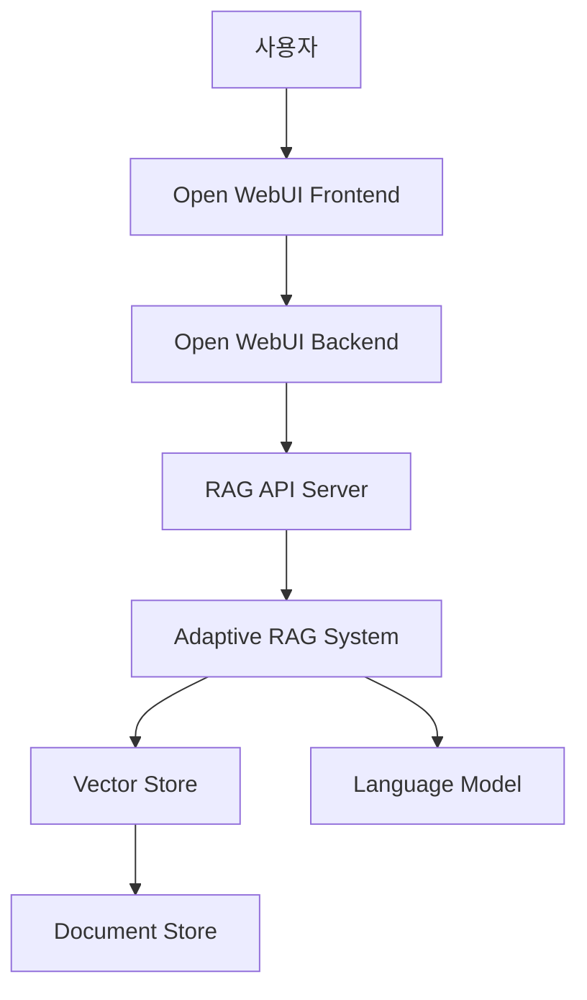
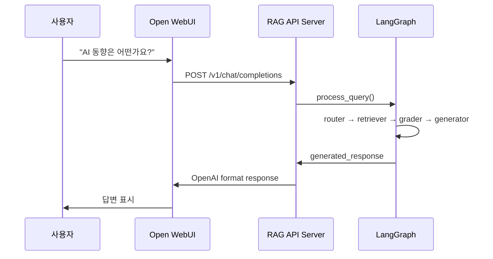

# 기술 가이드 (Technical Guide)

이 문서는 Open WebUI와 자체 구현한 Adaptive RAG 시스템의 기술적 연동 방법과 커스터마이징을 상세히 설명합니다.

> **📖 기본 설정은 [README.md](README.md)를 참조하세요.**

## 📖 목차

1. [시스템 아키텍처](#시스템-아키텍처)
2. [RAG API 서버 구조](#rag-api-서버-구조)
3. [Open WebUI 연동 방식](#open-webui-연동-방식)
4. [고급 설정](#고급-설정)
5. [API 명세](#api-명세)
6. [커스터마이징 가이드](#커스터마이징-가이드)
7. [고급 디버깅](#고급-디버깅)
8. [고급 기능 및 확장](#고급-기능-및-확장)
9. [데이터 저장소](#데이터-저장소-open-webui)

## 🏗 시스템 아키텍처



### 컴포넌트 설명

- **Open WebUI Frontend**: 사용자 인터페이스 (React 기반)
- **Open WebUI Backend**: 웹 서버 및 API 게이트웨이 (Python FastAPI)
- **RAG API Server**: 커스텀 RAG API 엔드포인트 (OpenAI 호환)
- **Adaptive RAG System**: LangGraph 기반 지능형 RAG
- **Vector Store**: FAISS 기반 문서 임베딩 저장소
- **Document Store**: PDF 문서 원본 저장소

## 🔧 RAG API 서버 구조

### 주요 파일

```
├── web_api_server.py          # OpenAI 호환 API 서버
├── adaptive_rag/
│   ├── graph.py              # LangGraph RAG 워크플로우
│   ├── nodes.py              # RAG 노드들 (Router, Retriever, etc.)
│   └── vector_store.py       # FAISS 벡터 스토어
├── pipelines/
│   └── adaptive_rag_pipeline.py  # 파이프라인 래퍼
```

### API 서버 주요 기능

1. **OpenAI 호환 엔드포인트 제공**
   ```python
   @app.post("/v1/chat/completions")
   async def chat_completions(request: ChatRequest):
       # Open WebUI에서 오는 요청을 RAG 시스템으로 전달
       return await process_rag_request(request)
   ```

2. **스트리밍 응답 지원**
   ```python
   async def stream_rag_response(query: str):
       # 실시간으로 응답을 스트리밍
       for chunk in rag_system.stream(query):
           yield f"data: {json.dumps(chunk)}\n\n"
   ```

## 🔗 Open WebUI 연동 방식

### 1. API Base URL 설정

Open WebUI는 환경변수를 통해 외부 API 서버에 연결됩니다:

```bash
# Open WebUI Backend 환경변수
OPENAI_API_BASE_URL=http://127.0.0.1:8000/v1
OPENAI_API_KEY=adaptive-rag-local-key
```

### 2. 요청 흐름



### 3. 응답 형식

RAG API는 OpenAI와 동일한 형식으로 응답합니다:

```json
{
    "id": "chatcmpl-xxx",
    "object": "chat.completion",
    "created": 1699999999,
    "model": "adaptive-rag-v1",
    "choices": [
        {
            "index": 0,
            "message": {
                "role": "assistant",
                "content": "AI 동향에 대해 말씀드리면..."
            },
            "finish_reason": "stop"
        }
    ],
    "usage": {
        "prompt_tokens": 50,
        "completion_tokens": 200,
        "total_tokens": 250
    }
}
```

## ⚙️ 고급 설정

### 환경변수 상세 설명

기본 설정은 [README.md](README.md)를 참조하고, 여기서는 고급 설정만 설명합니다.

```env
# RAG 시스템 고급 설정
CHUNK_SIZE=1000              # 문서 청크 크기
CHUNK_OVERLAP=200            # 청크 간 겹침 크기
TOP_K=5                      # 검색할 문서 개수
TEMPERATURE=0.7              # LLM 창의성 조절
SIMILARITY_THRESHOLD=0.7     # 문서 관련성 임계값
MAX_TOKENS=2000              # 최대 응답 길이

# 벡터 스토어 설정
VECTOR_STORE_TYPE=faiss      # faiss, chroma, pinecone
EMBEDDING_MODEL=text-embedding-ada-002
EMBEDDING_DIMENSION=1536

# 성능 최적화
BATCH_SIZE=32                # 문서 처리 배치 크기
CACHE_ENABLED=True           # 응답 캐싱 활성화
PARALLEL_PROCESSING=True     # 병렬 처리 활성화
```

### 포트 및 네트워크 설정

- **8000**: RAG API 서버 (기본)
- **8080**: Open WebUI 서버 (기본)
- **다른 포트 사용 시**: `.env` 파일에서 변경 가능
- **외부 접근**: `0.0.0.0`으로 바인딩하여 외부에서 접근 가능

## 📋 API 명세

### 1. 채팅 완료 엔드포인트

**Endpoint**: `POST /v1/chat/completions`

**Request Body**:
```json
{
    "model": "gpt-3.5-turbo",
    "messages": [
        {
            "role": "user", 
            "content": "사용자 질문"
        }
    ],
    "temperature": 0.7,
    "max_tokens": 2000,
    "stream": false
}
```

**Response**: OpenAI 호환 형식

### 2. 건강 상태 확인

**Endpoint**: `GET /health`

**Response**:
```json
{
    "status": "healthy",
    "vector_store_loaded": true,
    "documents_count": 150
}
```

### 3. API 문서

**Endpoint**: `GET /docs`

Swagger UI를 통한 대화형 API 문서 제공

## 🛠 커스터마이징 가이드

### 1. RAG 파라미터 조정

`adaptive_rag/graph.py`에서 RAG 동작을 수정할 수 있습니다:

```python
# 검색할 문서 개수 조정
retriever_config = {
    "top_k": 5,  # 기본값: 5
    "score_threshold": 0.7  # 관련성 임계값
}

# 생성 파라미터 조정
generator_config = {
    "temperature": 0.7,  # 창의성 조절
    "max_tokens": 2000   # 최대 응답 길이
}
```

### 2. 프롬프트 템플릿 수정

`adaptive_rag/nodes.py`에서 시스템 프롬프트를 수정할 수 있습니다:

```python
SYSTEM_PROMPT = """
당신은 한국어 문서를 기반으로 답변하는 AI 어시스턴트입니다.
다음 규칙을 따라 답변해주세요:
1. 제공된 문서를 기반으로만 답변
2. 불확실한 경우 "문서에서 찾을 수 없습니다" 명시
3. 한국어로 정확하고 친절하게 답변
"""
```

### 3. 문서 처리 로직 확장

새로운 문서 형식 지원을 위해 `document_processing/` 모듈을 확장할 수 있습니다:

```python
# document_processing/word.py
class WordRetrievalChain:
    def load_documents(self, file_paths):
        # Word 문서 처리 로직
        pass
```

### 4. 벡터 스토어 변경

FAISS 대신 다른 벡터 DB를 사용하려면:

```python
# adaptive_rag/vector_store.py
from langchain_chroma import Chroma

class ChromaVectorStore:
    def __init__(self, embedding_function):
        self.db = Chroma(embedding_function=embedding_function)
```

## 🔍 고급 디버깅

### 1. 상세 로그 분석

```bash
# RAG 서버 상세 로그
python scripts/start_rag_server.py --log-level DEBUG

# Open WebUI 로그 확인  
tail -f logs/webui.log | grep -E "(ERROR|WARN|RAG)"
```

### 2. API 성능 테스트

```bash
# 부하 테스트
curl -X POST http://localhost:8000/v1/chat/completions \
  -H "Content-Type: application/json" \
  -d '{
    "model": "gpt-3.5-turbo",
    "messages": [{"role": "user", "content": "테스트 질문"}]
  }' \
  -w "응답 시간: %{time_total}s\n"

# 동시 요청 테스트
for i in {1..10}; do
  curl -X POST http://localhost:8000/v1/chat/completions \
    -H "Content-Type: application/json" \
    -d '{"model": "gpt-3.5-turbo", "messages": [{"role": "user", "content": "테스트 '$i'"}]}' &
done
```

### 3. 벡터 스토어 분석

```python
from adaptive_rag.vector_store import FAISSVectorStore
import numpy as np

# 벡터 스토어 로드 및 분석
vs = FAISSVectorStore.load("data/vector_store")
print(f"문서 개수: {vs.index.ntotal}")
print(f"벡터 차원: {vs.index.d}")

# 유사도 분포 분석
similarities = []
for i in range(min(100, vs.index.ntotal)):
    query = np.random.random((1, vs.index.d)).astype('float32')
    scores, _ = vs.index.search(query, 5)
    similarities.extend(scores[0])

print(f"평균 유사도: {np.mean(similarities):.3f}")
print(f"유사도 표준편차: {np.std(similarities):.3f}")
```

## 🚀 고급 기능 및 확장

### 1. 다중 모델 지원

여러 언어 모델을 동시에 지원:

```python
# adaptive_rag/models.py
from langchain_openai import ChatOpenAI
from langchain_anthropic import ChatAnthropic

MODELS = {
    "gpt-3.5-turbo": ChatOpenAI(model="gpt-3.5-turbo", temperature=0.7),
    "gpt-4": ChatOpenAI(model="gpt-4", temperature=0.7),
    "claude-3": ChatAnthropic(model="claude-3-sonnet-20240229"),
    "local-llama": LocalLLM(model_path="./models/llama-2-7b")
}

def get_model(model_name: str):
    return MODELS.get(model_name, MODELS["gpt-3.5-turbo"])
```

### 2. 사용자별 컨텍스트 관리

사용자별로 다른 문서 세트 제공:

```python
# adaptive_rag/user_context.py
class UserContextManager:
    def __init__(self):
        self.user_stores = {}
    
    def get_user_vector_store(self, user_id: str):
        if user_id not in self.user_stores:
            store_path = f"data/users/{user_id}/vector_store"
            if os.path.exists(store_path):
                self.user_stores[user_id] = FAISSVectorStore.load(store_path)
            else:
                # 기본 벡터 스토어 사용
                self.user_stores[user_id] = FAISSVectorStore.load("data/vector_store")
        return self.user_stores[user_id]
```

### 3. 실시간 문서 업데이트

파일 시스템 감시를 통한 자동 인덱싱:

```python
# scripts/document_watcher.py
from watchdog.observers import Observer
from watchdog.events import FileSystemEventHandler

class DocumentWatcher(FileSystemEventHandler):
    def __init__(self, rag_system):
        self.rag_system = rag_system
    
    def on_created(self, event):
        if event.src_path.endswith('.pdf'):
            logger.info(f"새 문서 감지: {event.src_path}")
            self.rag_system.index_document(event.src_path)
    
    def on_modified(self, event):
        if event.src_path.endswith('.pdf'):
            logger.info(f"문서 수정 감지: {event.src_path}")
            self.rag_system.reindex_document(event.src_path)

# 사용법
observer = Observer()
observer.schedule(DocumentWatcher(rag_system), "data/documents", recursive=True)
observer.start()
```

### 4. 응답 캐싱 시스템

성능 향상을 위한 응답 캐싱:

```python
# adaptive_rag/cache.py
import hashlib
import json
from functools import lru_cache

class ResponseCache:
    def __init__(self, max_size=1000):
        self.cache = {}
        self.max_size = max_size
    
    def get_cache_key(self, query: str, context: str) -> str:
        content = f"{query}:{context}"
        return hashlib.md5(content.encode()).hexdigest()
    
    def get(self, query: str, context: str):
        key = self.get_cache_key(query, context)
        return self.cache.get(key)
    
    def set(self, query: str, context: str, response: str):
        if len(self.cache) >= self.max_size:
            # 가장 오래된 항목 제거
            oldest_key = next(iter(self.cache))
            del self.cache[oldest_key]
        
        key = self.get_cache_key(query, context)
        self.cache[key] = response
```

### 5. 모니터링 및 메트릭

시스템 성능 모니터링:

```python
# adaptive_rag/metrics.py
import time
from collections import defaultdict

class MetricsCollector:
    def __init__(self):
        self.request_count = 0
        self.response_times = []
        self.error_count = 0
        self.query_types = defaultdict(int)
    
    def record_request(self, query: str, response_time: float, success: bool):
        self.request_count += 1
        self.response_times.append(response_time)
        if not success:
            self.error_count += 1
        
        # 쿼리 유형 분석 (간단한 키워드 기반)
        if "요약" in query:
            self.query_types["summary"] += 1
        elif "비교" in query:
            self.query_types["comparison"] += 1
        else:
            self.query_types["general"] += 1
    
    def get_stats(self):
        avg_response_time = sum(self.response_times) / len(self.response_times) if self.response_times else 0
        return {
            "total_requests": self.request_count,
            "average_response_time": avg_response_time,
            "error_rate": self.error_count / self.request_count if self.request_count > 0 else 0,
            "query_types": dict(self.query_types)
        }
```

## 💾 데이터 저장소 (Open WebUI)

Open WebUI는 사용자의 대화 기록과 메모리를 SQLite 데이터베이스에 저장합니다.

### 📍 데이터베이스 위치
```
data/webui/webui.db
```

### 🗃️ 주요 테이블 구조

#### 1. **chat** 테이블 - 대화 기록
```sql
CREATE TABLE chat (
    id VARCHAR PRIMARY KEY,           -- 채팅 세션 ID
    user_id VARCHAR,                 -- 사용자 ID
    title TEXT,                      -- 채팅 제목
    chat JSON,                       -- 전체 대화 내용 (JSON 형식)
    created_at BIGINT,               -- 생성 시간
    updated_at BIGINT                -- 수정 시간
);
```

**저장되는 데이터:**
- 사용자 질문과 AI 답변의 전체 대화
- 각 메시지의 역할 (user/assistant)
- 메시지 생성 시간
- 채팅 세션별 제목

#### 2. **user** 테이블 - 사용자 정보
```sql
CREATE TABLE user (
    id VARCHAR PRIMARY KEY,           -- 사용자 ID
    name VARCHAR,                     -- 사용자 이름
    email VARCHAR,                    -- 이메일
    profile_image_url TEXT,           -- 프로필 이미지
    role VARCHAR,                     -- 사용자 역할
    created_at BIGINT,                -- 계정 생성 시간
    updated_at BIGINT                 -- 정보 수정 시간
);
```

#### 3. **memory** 테이블 - 사용자 메모리
```sql
CREATE TABLE memory (
    id VARCHAR PRIMARY KEY,           -- 메모리 ID
    user_id VARCHAR,                  -- 사용자 ID
    content TEXT,                     -- 메모리 내용
    created_at BIGINT,                -- 생성 시간
    updated_at BIGINT                 -- 수정 시간
);
```

**저장되는 데이터:**
- 사용자가 설정한 개인 메모리
- AI가 기억해야 할 중요한 정보
- 대화 컨텍스트 유지를 위한 데이터

#### 4. **file** 테이블 - 업로드된 파일
```sql
CREATE TABLE file (
    id VARCHAR PRIMARY KEY,           -- 파일 ID
    user_id VARCHAR,                  -- 사용자 ID
    name VARCHAR,                     -- 파일명
    path VARCHAR,                     -- 파일 경로
    size BIGINT,                      -- 파일 크기
    type VARCHAR,                     -- 파일 타입
    created_at BIGINT                 -- 업로드 시간
);
```

### 🔍 데이터 확인 방법

#### SQLite 명령어로 직접 확인:
```bash
# 데이터베이스 접속
sqlite3 data/webui/webui.db

# 테이블 목록 확인
.tables

# 채팅 기록 확인
SELECT id, user_id, title, created_at FROM chat LIMIT 5;

# 사용자 정보 확인
SELECT id, name, email FROM user;

# 메모리 확인
SELECT id, user_id, content FROM memory;

# 종료
.quit
```

#### Python으로 데이터 확인:
```python
import sqlite3
import json

# 데이터베이스 연결
conn = sqlite3.connect('data/webui/webui.db')
cursor = conn.cursor()

# 채팅 기록 조회
cursor.execute("SELECT id, title, chat FROM chat LIMIT 3")
for row in cursor.fetchall():
    chat_id, title, chat_data = row
    print(f"채팅 ID: {chat_id}")
    print(f"제목: {title}")
    print(f"대화 내용: {json.loads(chat_data)}")
    print("---")

conn.close()
```

### 🗂️ 데이터 백업 및 초기화

#### 백업:
```bash
# 데이터베이스 백업
cp data/webui/webui.db data/webui/webui_backup_$(date +%Y%m%d).db
```

#### 초기화 (모든 데이터 삭제):
```bash
# 데이터베이스 삭제 (주의: 모든 대화 기록이 사라집니다!)
rm data/webui/webui.db

# Open WebUI 재시작 시 새 데이터베이스가 자동 생성됩니다
```

### 💡 데이터 분리 설계

**시스템별 역할 분담:**
- **Open WebUI**: 사용자 인터페이스와 대화 기록 관리
- **RAG 시스템**: 문서 검색과 답변 생성 (메모리 없음)
- **역할 분담**: 각 시스템이 고유한 책임을 가짐

**실제 사용 시나리오:**
1. 사용자가 질문 → Open WebUI가 받음
2. Open WebUI가 RAG API 호출 → `messages` 배열 전달
3. RAG API는 마지막 메시지만 사용 → 이전 대화 무시
4. 답변 생성 → 문서 기반 답변만
5. Open WebUI가 답변을 `webui.db`에 저장 → 대화 기록 보존

이렇게 **RAG 시스템은 단순하게 유지**하고, **Open WebUI가 사용자 경험을 관리**하는 구조입니다! 🎯

## 📚 참고 자료

- [Open WebUI 공식 문서](https://docs.openwebui.com/)
- [LangChain 문서](https://python.langchain.com/)
- [LangGraph 튜토리얼](https://langchain-ai.github.io/langgraph/)
- [FAISS 문서](https://faiss.ai/)
- [FastAPI 문서](https://fastapi.tiangolo.com/)

---

이 가이드를 통해 Open WebUI와 Adaptive RAG 시스템의 연동 원리를 이해하고, 필요에 따라 커스터마이징할 수 있습니다.
